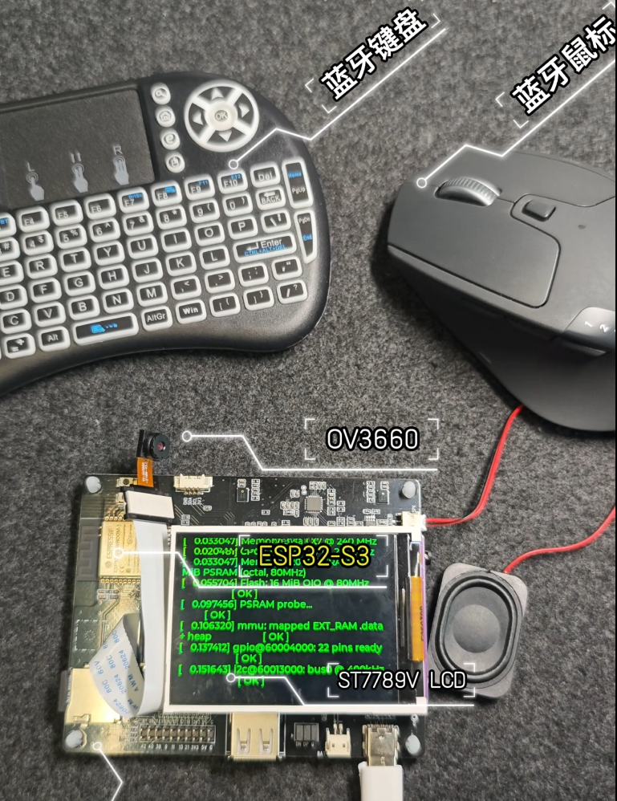
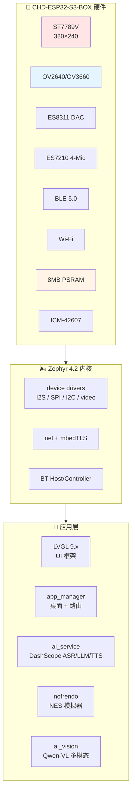
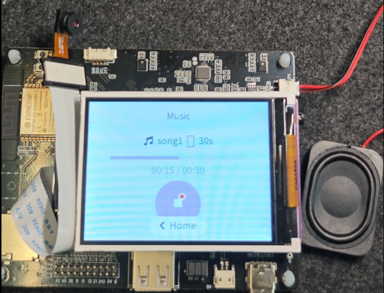
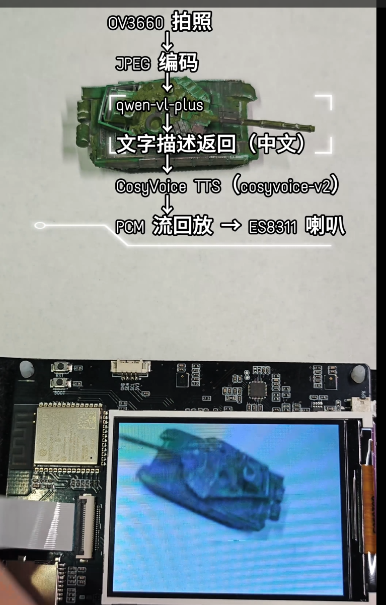
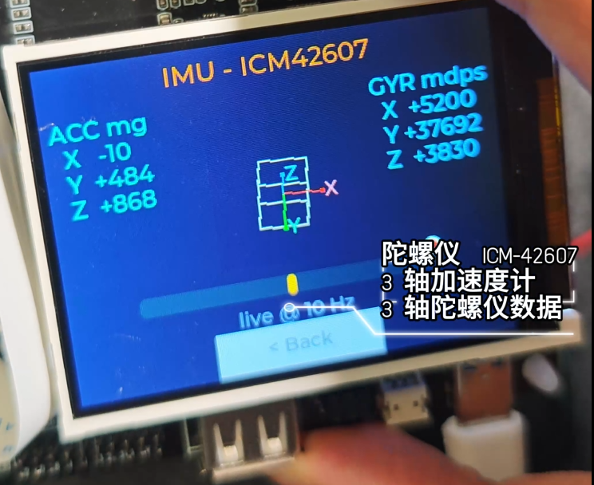
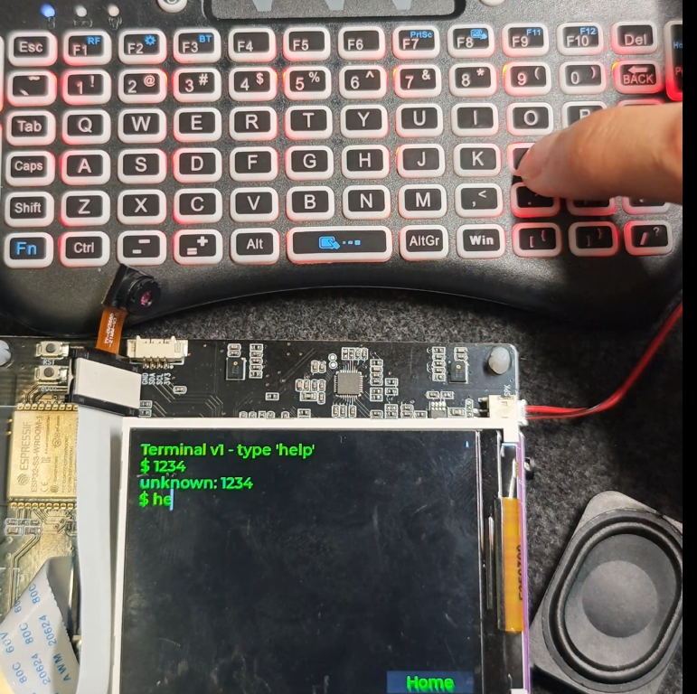

<div align="center">

# 🃏 Zephyr-Card

**一张手掌大的 ESP32-S3 开发板，三套固件，一个完整的"口袋桌面 OS"。**

基于 [Zephyr RTOS 4.2](https://www.zephyrproject.org/) + LVGL 9.x + ESP-IDF HAL，
用 **ESP32-S3-BOX** 用这块开发板，从零做出一个能AI语音沟通、能玩 NES、能跑大模型视觉问答的"掌上小电脑"。


[**📖 三个固件总览**](#-三个固件三种玩法) ·
[**🛠️ 快速烧录**](#️-quick-start) ·
[**🕳️ 踩坑笔记**](#-踩坑实录18-个让我掉头发的-bug) ·
[**🎬 视频演示**](#-视频演示)

</div>

---

## 💡 这是什么？



`Zephyr-Card` 是我用 **ESP32-S3-BOX** 开发板做的一个个人项目 —— 一张扑克牌大小的开发板，上面塞下了：

- 320×240 ST7789V LCD（电容触摸只是装饰，目前用 BLE-HID 鼠标驱动）
- ES8311 DAC（喇叭）+ ES7210 ADC（4 麦阵列）
- OV2640 / OV3660 摄像头（LCD-CAM 接口）
- ICM-42607-C 6 轴 IMU
- BLE 5.0 + Wi-Fi 双模
- 8 MB PSRAM + 16 MB Flash + SD 卡槽

---

## 🎮 三个固件，三种玩法

> ESP32-S3 的 LCD-CAM 外设 与 蓝牙控制器 在 PSRAM 高负载下会互相干扰；nofrendo NES 模拟器又会
> 长期占满 PSRAM 堆。**三个固件不是偷懒，而是被硬件资源逼出来的最优解**。下表是它们的分工：

| 固件 | 路径 | 主打功能 | BLE | Wi-Fi | 摄像头 | NES |
|:---:|:---|:---|:---:|:---:|:---:|:---:|
| 🏠 **launcher**<br/>*主桌面* | `samples/boards/espressif/apps/new/launcher` | 8 个 App 桌面 / AI 助手 / 音乐 / 终端 / 人脸表情 / IMU / BLE 鼠标光标 | ✅ | ✅ | ❌ | 占位 |
| 🤖 **launcher_full**<br/>*AI 视觉机* | `samples/boards/espressif/apps/new/launcher_full` | 拍照→Qwen-VL-Plus 多模态识物→CosyVoice TTS 朗读结果 | ❌ | ✅ | ✅ | ❌ |
| 🕹️ **launcher_nes**<br/>*游戏机* | `samples/boards/espressif/apps/new/launcher_nes` | 主桌面 + 真实 nofrendo NES 模拟器（内置 sbp.nes） | ✅ | ✅ | ❌ | ✅ |

> **为什么要三个固件？** 见下方 [硬件资源冲突说明](#️-为什么是三个固件而不是一个)。

---

## 🏗️ 系统架构



---

## 🛠️ Quick Start

### 1. 准备环境

```bash
# Windows + ESP-IDF + Zephyr SDK
cd zephyrproject
west update
west zephyr-export
pip install -r zephyr/scripts/requirements.txt

# 拉 ESP HAL blob（摄像头/Wi-Fi 二进制需要）
west blobs fetch hal_espressif
```

### 2. 烧录任意一个固件

```powershell
cd zephyrproject\zephyr

# 主桌面
west build -b esp32s3_devkitc/esp32s3/procpu samples/boards/espressif/apps/new/launcher --build-dir build_launcher
west flash --build-dir build_launcher

# AI 视觉机
west build -b esp32s3_devkitc/esp32s3/procpu samples/boards/espressif/apps/new/launcher_full --build-dir build_launcher_full
west flash --build-dir build_launcher_full

# NES 游戏机
west build -b esp32s3_devkitc/esp32s3/procpu samples/boards/espressif/apps/new/launcher_nes --build-dir build_launcher_nes
west flash --build-dir build_launcher_nes
```

> ⚠️ Windows cmd.exe 命令行有 8K 长度限制，nofrendo 一旦展开就会爆。各固件 `CMakeLists.txt` 里
> 已用 `cmake_policy(SET CMP0151 NEW)` + `CMAKE_NINJA_FORCE_RESPONSE_FILE` 强制走 ninja
> response file 规避，**不要删**。

### 3. AI 功能需要密钥

`launcher` / `launcher_full` 用阿里云 [DashScope](https://dashscope.console.aliyun.com/) 接 Qwen 系列模型。**所有 `secrets.h` 已在 `.gitignore` 里禁止入库**，需要按下面 [🧠 AI 链路 & API 配置](#-ai-链路--api-配置) 一节自己创建并填入。

> ⚠️ **绝不要把 `secrets.h` 提交到公开仓库**！
> 请你 fork 后第一件事就是确认你的 `.gitignore` 生效，并用全新 key。

---

## 🧠 AI 链路 & API 配置

本项目所有 AI 能力**全部走阿里云 DashScope**（百炼平台），共两条独立链路。

### 🎓 前置科普：ASR / LLM / TTS 是什么？

任何语音助手（Siri / 小爱 / Alexa / 我们的 AI Assistant）背后都是**三件套**：

```
🎤 你说话 → [ASR 听] → [LLM 想] → [TTS 说] → 🔊 喇叭
```

| 缩写 | 全称 | 中文 | 担任职责 | 类比 |
|---|---|---|---|---|
| **ASR** | Automatic Speech Recognition | 自动语音识别 | 把**音频** → **文字** | 接线员的**耳朵** |
| **LLM** | Large Language Model | 大语言模型 | 把**问题文字** → **答案文字** | 接线员的**脑子** |
| **TTS** | Text-To-Speech | 语音合成 | 把**答案文字** → **音频** | 接线员的**嘴巴** |

少了任何一个，对话就没法闭环。

历史上这三步通常**由不同厂商擅长**（Google ASR / OpenAI LLM / Azure TTS），所以"分开拼装"是
经典做法。Realtime "一站式"模型（如 `qwen3.5-omni-flash-realtime`）把三步塞进一个 WebSocket，
理论延迟 ≤1s 可打断对话，但代价是**贵 / 脆弱 / 不可换** —— 见下面 [设计决策 #2](#决策-2语音链路从-realtime-omni-切到-plan-a-三步)。

### 链路 A — `launcher` 的「AI Assistant」语音助手

```
🎤 ES7210 录音 (16kHz mono, 最长 10s)
        ↓
   WAV 封装 + base64
        ↓
┌──────────── 当前激活：Plan-A 三步链路 ────────────┐
│ Step 1：ASR                                      │
│   POST  /api/v1/services/aigc/                  │
│         multimodal-generation/generation         │
│   model = qwen3-asr-flash                        │
│                                                  │
│ Step 2：LLM                                      │
│   POST  /compatible-mode/v1/chat/completions    │
│   model = qwen-turbo  (SSE 流式)                 │
│                                                  │
│ Step 3：TTS                                      │
│   WebSocket /api-ws/v1/realtime                  │
│   model = qwen3-tts-flash-realtime               │
│   voice = Cherry                                 │
│   返回 base64 PCM 24kHz → 重采样 16kHz → 播放    │
└──────────────────────────────────────────────────┘
        ↓
   PCM 流回放 → ES8311 喇叭（端到端 ~8s）

┌──────────── 备用（代码保留，flag 关闭）─────────┐
│ qwen3.5-omni-flash-realtime  全双工 ASR+LLM+TTS │
│ 在 ai_service.c 把 AI_USE_REALTIME 改回 1 即启用 │
│ 端到端 ~3-5s，但稳定性与并发额度差于分步链路    │
└──────────────────────────────────────────────────┘
```

**当前实际用到的模型**：

| 阶段 | 模型 | DashScope 模型 ID | 协议 |
|---|---|---|---|
| ASR | 一句话识别 | `qwen3-asr-flash` | HTTPS POST |
| LLM | 对话生成 | `qwen-turbo` | HTTPS SSE |
| TTS | 语音合成 | `qwen3-tts-flash-realtime` | WebSocket（音色 Cherry） |
| *(备用)* | Realtime 全双工 | `qwen3.5-omni-flash-realtime` | WebSocket（默认禁用） |

> 📍 想切换链路？编辑 [`launcher/src/ai_service.c`](samples/boards/espressif/apps/new/launcher/src/ai_service.c) 顶部 4 个宏：
> `AI_DEBUG_PIPELINE_ASR` / `AI_DEBUG_PIPELINE_LLM` / `AI_USE_QWEN_TTS` / `AI_USE_REALTIME`。

### 链路 B — `launcher_full` 的「AI Vision」视觉问答

```
📷 OV2640/OV3660 拍照 (RGB565 320×240)
        ↓
   JPEG 编码（jpeg_enc.c）
        ↓
   HTTPS POST → DashScope 兼容模式
   /compatible-mode/v1/chat/completions
   model = "qwen-vl-plus"
        ↓
   文字描述返回（中文）
        ↓
   CosyVoice TTS（cosyvoice-v2）
        ↓
   PCM 流回放 → ES8311 喇叭
```

**用到的模型**：

| 模型 | 用途 | DashScope 模型 ID |
|---|---|---|
| 视觉 LLM | 图像 + 文本多模态 | `qwen-vl-plus` |
| TTS | 中文语音合成 | `cosyvoice-v2` |

### API Key 配置（必做）

#### Step 1：在 DashScope 控制台创建 Key
1. 注册/登录 [https://dashscope.console.aliyun.com/](https://dashscope.console.aliyun.com/)
2. 完成实名认证（个人开发者免费）
3. 「API-KEY 管理」→ 「创建新的 API-KEY」
4. **开通对应模型权限**：
   - launcher → `qwen3.5-omni-flash-realtime` / `qwen3-asr-flash` / `qwen-turbo` / `qwen3-tts-flash`
   - launcher_full → `qwen-vl-plus` / `cosyvoice-v2`
   - 模型详情：[模型广场](https://dashscope.console.aliyun.com/model)，多数有免费额度

#### Step 2：复制模板 + 填入密钥

```powershell
# launcher
Copy-Item samples\boards\espressif\apps\new\launcher\src\secrets.h.example `
          samples\boards\espressif\apps\new\launcher\src\secrets.h

# launcher_full
Copy-Item samples\boards\espressif\apps\new\launcher_full\src\secrets.h.example `
          samples\boards\espressif\apps\new\launcher_full\src\secrets.h

# launcher_nes（共用 launcher 的 secrets 结构）
Copy-Item samples\boards\espressif\apps\new\launcher_nes\src\secrets.h.example `
          samples\boards\espressif\apps\new\launcher_nes\src\secrets.h
```

然后用编辑器打开 `secrets.h`，把 `WIFI_SSID` / `WIFI_PSK` / `AI_API_KEY`（或 `BAILIAN_API_KEY`）替换成你自己的值。

#### Step 3：验证 `.gitignore` 已生效

```powershell
git status samples\boards\espressif\apps\new\launcher\src\secrets.h
# 应输出空（被 ignore）

git check-ignore -v samples\boards\espressif\apps\new\launcher\src\secrets.h
# 应输出 .gitignore 行号
```

### 🔐 安全最佳实践

- ✅ 用 **API-KEY** 而非 RAM 子用户长期 AK / SK（DashScope 推荐）
- ✅ 创建 key 时设置**最小模型权限**（只勾你要用的）
- ✅ 在 DashScope 控制台**设置每月预算上限**（防止盗刷）
- ✅ key 一旦怀疑泄漏，立刻在控制台**作废重建**
- ❌ 不要把 key 写进 README / 截图 / 视频里
- ❌ 不要 push `secrets.h`（本项目 `.gitignore` 已自动屏蔽）

---
## 🧩 设计决策

### 决策 1：为什么是"三个固件"而不是一个？
见上方 [⚙️ 为什么是"三个"固件而不是一个？](#️-为什么是三个固件而不是一个)。

### 决策 2：语音链路从 Realtime Omni 切到 Plan-A 三步

最初代码用的是 `qwen3.5-omni-flash-realtime` —— 一个 WebSocket 全双工模型，**理论端到端延迟 ≤1s 可打断对话**。
但实测后发现 ESP32-S3 跑不动它的"流式播放"，于是从一个模型拆成了三步链路。

**完整决策路径**（按 `ai_service.c` commit 时间）：

```
fix(tls):     修 TLS 1.2 握手（RSA-PSS / PSA PRF）
fix(audio):   把 Realtime 流式播放改"累积后一次性播"  ← 关键转折点
feat(asr):    加 qwen3-asr-flash 单步探针
feat(llm):    加 qwen-turbo 单步探针
refactor:     TTS 回退到 collect-all-then-play
feat(tts):    集成 qwen3-tts-flash-realtime + TLS/TCP 调优
perf:         WiFi/TCP buffer 调优，端到端 ≤8s
```

**5 个核心原因**：

#### 1️⃣ 流式播放在 ESP32-S3 上不稳定（直接动因）
Realtime 全双工要求边录边传边收边播，但 ESP32-S3 上：
- 网络抖动 → 收音频包不连续 → I2S 喇叭"咔哒咔哒"
- 同时跑 BLE Host + LVGL + Wi-Fi → audio task 抢不到 CPU
- 修复方式是改成"累积完再一次性播"，**这等于已经放弃了 Realtime 的核心优势（低延迟）**

一旦放弃流式，Realtime 只剩"单 WebSocket"这一个微弱理由，性价比骤降。

#### 2️⃣ 调试与归因困难
Realtime 是黑盒：用户说话 → 喇叭出错答案。**到底 ASR 听错？LLM 答错？TTS 念错？**

拆三步后每一步都能在串口日志里看到中间产物，**精确归因，迭代速度提升 5-10 倍**。

#### 3️⃣ 模型可独立挑选
分步后可以：
- ASR 选 `qwen3-asr-flash`（速度最快）
- LLM 选 `qwen-turbo`（性价比最高），日后想升级换 `qwen-plus` / `qwen-max`
- TTS 选 `qwen3-tts-flash-realtime` + `Cherry` 音色（**比 Omni 内置音色更自然**）

#### 4️⃣ 失败可单步重试
- Realtime WebSocket 断 → 整局会话作废 → 重连 → 重新初始化
- 三步 HTTPS 短连接 → 任何一步失败可单独重试

#### 5️⃣ 计费更可控
- Realtime 按音频时长计费（说得越久越贵）
- 分步按 token 计费，更精细，单次成本透明

**对比小结**：

| 维度 | Realtime Omni | Plan-A 三步 |
|---|---|---|
| 端到端延迟 | 3-5s 理论 / 6-8s 实际带卡顿 | 8s 稳定无卡顿 |
| 调试性 | ❌ 黑盒 | ✅ 三步独立日志 |
| 模型可换 | ❌ 锁定 | ✅ 任意拼装 |
| 失败重试 | ❌ 整局重来 | ✅ 单步重试 |
| 音色自然度 | 一般 | ✅ Cherry 更好 |
| 内存占用 | 高（持续 WS buffer） | ✅ 短连接，可释放 |
| 代码复杂度 | 高（状态机 + 流式 buffer） | ✅ 三个独立函数 |

**结论**：8 秒延迟对一个语音玩具完全可接受，工程上选稳定的三步链路。
Realtime 路径在 [`ai_service.c`](samples/boards/espressif/apps/new/launcher/src/ai_service.c) 第 81 行 `AI_USE_REALTIME=0` 关闭，未来想试一行宏切回。

---
## 🧩 设计决策

### 决策 1：为什么是"三个固件"而不是一个？
见上方 [⚙️ 为什么是"三个"固件而不是一个？](#️-为什么是三个固件而不是一个)。

### 决策 2：语音链路从 Realtime Omni 切到 Plan-A 三步

最初代码用的是 `qwen3.5-omni-flash-realtime` —— 一个 WebSocket 全双工模型，**理论端到端延迟 ≤1s 可打断对话**。
但实测后发现 ESP32-S3 跑不动它的"流式播放"，于是从一个模型拆成了三步链路。

**完整决策路径**（按 `ai_service.c` commit 时间）：

```
fix(tls):     修 TLS 1.2 握手（RSA-PSS / PSA PRF）
fix(audio):   把 Realtime 流式播放改"累积后一次性播"  ← 关键转折点
feat(asr):    加 qwen3-asr-flash 单步探针
feat(llm):    加 qwen-turbo 单步探针
refactor:     TTS 回退到 collect-all-then-play
feat(tts):    集成 qwen3-tts-flash-realtime + TLS/TCP 调优
perf:         WiFi/TCP buffer 调优，端到端 ≤8s
```

**5 个核心原因**：

#### 1️⃣ 流式播放在 ESP32-S3 上不稳定（直接动因）
Realtime 全双工要求边录边传边收边播，但 ESP32-S3 上：
- 网络抖动 → 收音频包不连续 → I2S 喇叭"咔哒咔哒"
- 同时跑 BLE Host + LVGL + Wi-Fi → audio task 抢不到 CPU
- 修复方式是改成"累积完再一次性播"，**这等于已经放弃了 Realtime 的核心优势（低延迟）**

一旦放弃流式，Realtime 只剩"单 WebSocket"这一个微弱理由，性价比骤降。

#### 2️⃣ 调试与归因困难
Realtime 是黑盒：用户说话 → 喇叭出错答案。**到底 ASR 听错？LLM 答错？TTS 念错？**

拆三步后每一步都能在串口日志里看到中间产物，**精确归因，迭代速度提升 5-10 倍**。

#### 3️⃣ 模型可独立挑选
分步后可以：
- ASR 选 `qwen3-asr-flash`（速度最快）
- LLM 选 `qwen-turbo`（性价比最高），日后想升级换 `qwen-plus` / `qwen-max`
- TTS 选 `qwen3-tts-flash-realtime` + `Cherry` 音色（**比 Omni 内置音色更自然**）

#### 4️⃣ 失败可单步重试
- Realtime WebSocket 断 → 整局会话作废 → 重连 → 重新初始化
- 三步 HTTPS 短连接 → 任何一步失败可单独重试

#### 5️⃣ 计费更可控
- Realtime 按音频时长计费（说得越久越贵）
- 分步按 token 计费，更精细，单次成本透明

**对比小结**：

| 维度 | Realtime Omni | Plan-A 三步 |
|---|---|---|
| 端到端延迟 | 3-5s 理论 / 6-8s 实际带卡顿 | 8s 稳定无卡顿 |
| 调试性 | ❌ 黑盒 | ✅ 三步独立日志 |
| 模型可换 | ❌ 锁定 | ✅ 任意拼装 |
| 失败重试 | ❌ 整局重来 | ✅ 单步重试 |
| 音色自然度 | 一般 | ✅ Cherry 更好 |
| 内存占用 | 高（持续 WS buffer） | ✅ 短连接，可释放 |
| 代码复杂度 | 高（状态机 + 流式 buffer） | ✅ 三个独立函数 |

**结论**：8 秒延迟对一个语音玩具完全可接受，工程上选稳定的三步链路。
Realtime 路径在 [`ai_service.c`](samples/boards/espressif/apps/new/launcher/src/ai_service.c) 第 81 行 `AI_USE_REALTIME=0` 关闭，未来想试一行宏切回。

---

## 🎯 功能清单

### `launcher` — 主桌面（每天都要用的那台）

| App | 功能 | 状态 |
|---|---|---|
| 🤖 AI Assistant | 一键语音 → ASR → LLM → TTS，端到端约 8 秒 | ✅ |
| 🎵 Music | 内嵌 30 秒 16 kHz 单声道 PCM，新拟物风格播放器 | ✅ |
| 💻 Terminal | BLE-HID 键盘驱动的交互式 shell | ✅ |
| 🙂 Face | 表情动画 | ✅ |
| 📐 IMU | ICM-42607 实时姿态可视化 | ✅ |
| 📷 Camera | 占位（详见 launcher_full） | 🚧 |
| 🎮 NES | 占位（详见 launcher_nes） | 🚧 |
| 🖼️ Photos | 图库 | ✅ |
| 🖱️ BLE-HID 鼠标 | 系统级光标，跨所有 App 通用 | ✅ |

### `launcher_full` — AI 视觉机

```
[BOOT 键短按] 拍照 → JPEG 编码 → HTTPS POST 到 DashScope qwen-vl-plus
    → 文字描述返回 → CosyVoice TTS → I2S 喇叭播放
```

实测识物准确度高，能读出"桌上有一杯咖啡和一台 ThinkPad"这种程度。
单次识别约 5–8 秒（取决于网络）。

### `launcher_nes` — 游戏机

- 内嵌经典 ROM `sbp.nes`（公有领域 demo）
- 60 FPS 全屏渲染（DMA double buffer）
- ES8311 立体声 APU 输出（**注意：I2S TX buffer 必须放 DRAM，不能放 PSRAM**，否则 GDMA 读出
  cache 不一致会出爆音）
- BLE-HID 键盘做手柄：方向键 + Z/X = A/B + Enter=Start + RShift=Select + **ESC=退出**
- 退出会触发 `sys_reboot(SYS_REBOOT_COLD)` —— 详见踩坑 #18

---

## 🎮 玩你自己的 NES 游戏 ROM

`launcher_nes` 默认编入的是公有领域 demo `sbp.nes`。**换成你自己的 ROM 只需要 3 步**：

### Step 1：找到一个合法的 ROM 文件

ROM 来源（**仅限你拥有原版卡带 / 公有领域作品 / 自制 homebrew**）：

| 来源 | 说明 | 链接 |
|---|---|---|
| 🆓 公有领域 / Homebrew | 完全合法，可商用 | [NESdev Homebrew](https://www.nesdev.org/wiki/Homebrew) · [itch.io NES tag](https://itch.io/games/tag-nes) |
| 🛒 你自己的卡带 | 用 [INL Retro Dumper](https://www.infiniteneslives.com/inlretro.php) 等设备从原版卡带读取 ROM | 自购卡带 + dumper |
| 📦 archive.org | 部分老游戏的厂商已放弃版权 | [archive.org](https://archive.org/) 搜 "NES ROM"（**法律风险自担**） |

> ⚠️ **法律提醒**：从互联网下载非公有领域的商业 ROM（如《超级马力欧》《魂斗罗》原版）在
> 大多数国家/地区构成版权侵权。**本项目不分发任何商业 ROM**，请遵守你所在地区的法律法规。

ROM 文件**必须满足**：
- ✅ 标准 iNES 格式（`.nes` 后缀，文件头 4 字节为 `NES\x1A`）
- ✅ Mapper 0/1/2/3/4（nofrendo 支持的范围）—— 大部分 1985-1990 年作品都是 Mapper 0/1
- ✅ 文件大小 ≤ **256 KB**（受 PSRAM 堆限制；Mapper 4 的大游戏可能不行）

### Step 2：替换 ROM 文件

```powershell
# 把你的 my_game.nes 复制覆盖默认 ROM
Copy-Item my_game.nes samples\boards\espressif\apps\new\launcher_nes\rom\sbp.nes -Force
```

或者**保留原文件名**，改 CMakeLists 的引用：

```cmake
# samples/boards/espressif/apps/new/launcher_nes/CMakeLists.txt 第 99 行
set(NES_ROM_FILE "${CMAKE_CURRENT_LIST_DIR}/rom/my_game.nes")  # 改成你的文件名
```

### Step 3：重新编译烧录

```powershell
# -p 强制清干净，确保新 ROM 被嵌入
west build -p -b esp32s3_devkitc/esp32s3/procpu samples\boards\espressif\apps\new\launcher_nes --build-dir build_launcher_nes
west flash --build-dir build_launcher_nes
```

启动后从主桌面点击 🎮 NES 图标即可进入新游戏。

### 控制键映射（BLE-HID 键盘）

| NES 按键 | 键盘按键 |
|:---:|:---:|
| ⬆️⬇️⬅️➡️ | 方向键 |
| A | `Z` |
| B | `X` |
| Start | `Enter` |
| Select | `Right Shift` |
| **退出回桌面** | `ESC` |

> 想改键位 → 编辑 [`samples/boards/espressif/apps/new/launcher_nes/src/nes/osd.c`](samples/boards/espressif/apps/new/launcher_nes/src/nes/osd.c) 中按键映射表。

### 常见问题

| 现象 | 原因 | 解决 |
|---|---|---|
| 启动后黑屏 / Mapper not supported | 该 ROM 用了 nofrendo 不支持的 Mapper | 换 Mapper 0/1/2/3/4 的游戏 |
| 编译报 `NES ROM not found` | 文件名/路径错了 | 检查 `CMakeLists.txt` 第 99 行 |
| 进入后立即崩溃 | ROM 文件被截断或非 iNES 格式 | 用 16 进制查看器确认头 4 字节是 `4E 45 53 1A` |
| 帧率慢/卡顿 | Mapper 4 大游戏 + PPU 频繁切 bank | nofrendo 性能上限，无解 |

---

## 📖 使用指南（每个 App 怎么玩）

### 🤖 AI 助手（语音对话）

> 固件：`launcher` · 入口：桌面 → 「AI Assistant」(靛蓝色圆球图标)
>

**前置条件**：
- 已配 Wi-Fi（在 `samples/.../launcher/src/secrets.h` 里填 SSID / 密码）
- 已配 DashScope API Key（`secrets.h` 里 `DASHSCOPE_API_KEY`）
- 已连接 BLE-HID 鼠标（用于点击 UI）

**操作步骤**：
1. 桌面点击 🤖 「AI Assistant」图标
2. 进入后**点击屏幕中央的麦克风按钮** → 开始录音（最多 10 秒）
3. **再次点击麦克风** → 上传到 DashScope `qwen3.5-omni-flash`
4. ASR + LLM + TTS 完整流式返回，**喇叭直接播放回复**（端到端约 8 秒）
5. 可以连续对话；左上角返回箭头退出

**支持的对话场景**：
- 日常问答（「成都今天天气」「讲个冷笑话」）
- 多轮上下文（上一轮提到的话题，下一轮可继续）
- 中英混说

**常见问题**：

| 现象 | 原因 | 解决 |
|---|---|---|
| 长按麦克风没反应 | BLE 鼠标没连上 | 用 Terminal `ble` 命令检查连接状态 |
| 录音后报 `tls handshake failed` | mbedTLS 配置缺失 | 见踩坑 #1 |
| 喇叭无声 | I2S 没初始化 / 音量调节问题 | 检查启动日志 `es8311 init OK` |

---

### 🎵 Music（音乐播放器）

> 固件：`launcher` · 入口：桌面 → 「Music」(紫色播放图标)
>



**默认行为**：内嵌一段 30 秒的 16 kHz / 16-bit / 单声道 PCM 片段（`src/apps/song1_30s.pcm`）。

**换成你自己的歌**：

#### Step 1：准备符合格式的 PCM 文件

**严格要求**：
- 采样率：**16000 Hz**
- 位深：**16-bit signed**
- 通道：**单声道（mono）**
- 编码：**raw PCM, little-endian**（**不要带 WAV 头**）
- 时长：**建议 30 秒以内**（每秒约 32 KB，太长会撑爆 flash）

#### Step 2：用 ffmpeg 转换

```powershell
# 任意 mp3/wav/flac → 16k mono raw PCM
ffmpeg -i your_song.mp3 -ac 1 -ar 16000 -f s16le -acodec pcm_s16le your_song.pcm
```

#### Step 3：替换 + 重编

```powershell
# 直接覆盖默认文件名（最简单）
Copy-Item your_song.pcm samples\boards\espressif\apps\new\launcher\src\apps\song1_30s.pcm -Force

# 重编
west build -p -b esp32s3_devkitc/esp32s3/procpu samples\boards\espressif\apps\new\launcher --build-dir build_launcher
west flash --build-dir build_launcher
```

> 想多放几首？修改 `launcher/CMakeLists.txt` 第 33-36 行的 `generate_inc_file_for_target`，
> 增加多个 inc 文件并在 `app_music.c` 里维护 playlist 数组。

---

### 🖱️ BLE-HID 蓝牙鼠标键盘

> 固件：`launcher` · `launcher_nes`（`launcher_full` 因冲突没有 BLE）

**作者实测可用的型号**：

| 设备 | 型号 | 协议 | 备注 |
|---|---|:---:|---|
| 鼠标 | 罗技 M170 / M186（接收器拔了走 BLE 的那种不算） | — | ❌ 这种是 2.4G 不是 BLE |
| 鼠标 | **罗技 M720 (Bluetooth 模式)** | BLE 5.0 | ✅ 实测可用 |
| 键盘 | **双模迷你无线蓝牙键盘** | BLE 5.0 | ✅ 实测可用 |

**配对流程**：
1. 烧录 `launcher` 后**首次启动**会进入 BLE 广播模式（屏幕左上角应显示 BLE 图标）
2. 鼠标/键盘进入配对模式（具体按键看你设备说明书）
3. 在你**手机/电脑上扫描** → 找到 `Zephyr-Card` 设备 → 配对 *（注意：是 ESP32 主动作为 HID Host，而不是被你的电脑配对）*

> 💡 **关键澄清**：本项目里 ESP32 是 **HID Host（电脑/手机端的角色）**，鼠标/键盘是 **HID Device（你日常用的从设备）**。
> 也就是说：**让你的鼠标进入"等待主机连接"模式，ESP32 会主动扫描并连接它**。

**识别不到/连不上的排查**：

| 现象 | 原因 | 解决 |
|---|---|---|
| 完全扫不到 | 设备没进入广播模式 | 重新进入配对模式（连按 connect 键） |
| 扫到但配对失败 | 设备走了**经典蓝牙（BR/EDR）** 而非 BLE | 换支持 BLE-HID 的设备（参考上表） |
| 配对成功但点击没反应 | LVGL input group 没绑定 | 串口看日志 `parse_mouse_report` 是否有输出 |
| 用一段时间后掉线 | BLE 链路超时 | 在 Terminal 输入 `ble` 看连接状态，必要时重启 |

**清除配对记录**：进 Terminal 输入 `ble unpair`（或在源码 `ble_hid.c` 调用 `bt_unpair`）。

---

### 📷 Camera + AI 物体识别

> 固件：**`launcher_full`**（**不是** `launcher`！launcher 里 Camera 是占位）
>



**为什么是单独固件**：见上方 [冲突 1](#️-为什么是三个固件而不是一个) — BT 与 LCD-CAM 不能共存。

**前置条件**：
- 已烧录 `launcher_full` 固件
- Wi-Fi 已配（`launcher_full/src/secrets.h`）
- DashScope API Key 已配，且账号开通了 `qwen-vl-plus` 模型权限
- 摄像头物理连接 OK（OV2640 / OV3660 排线插紧）

**操作步骤**：
1. 启动后默认进入 `home_ui`，4×2 图标网格
2. 用 **BOOT 键**（板载 IO0 按键，**不需要蓝牙鼠标**）：
   - **短按 1 次** → 焦点切到下一个图标
   - **双击** → 激活当前图标
3. 切到 「AI Vision」 → 双击进入
4. **再次短按 BOOT 键** → 拍照 + 上传 + 识别
5. 识别结果**显示在屏幕**，并通过**喇叭朗读**（CosyVoice TTS）

**典型识别场景**：
- 桌面物品（咖啡杯、键盘、笔记本）
- 印刷文字识别（书本封面、海报）
- 简单场景描述（"室内、白墙、有窗帘"）

**常见问题**：

| 现象 | 原因 | 解决 |
|---|---|---|
| 屏幕预览灰色 | OV3660 颜色矩阵未初始化 | 见踩坑 #6 |
| 拍照后报 `qwen-vl error 400` | API key 无效或没开通 vl 模型 | 控制台核查 |
| TTS 朗读延迟 > 10 秒 | 网络慢 / DashScope 限流 | 多试几次 |

---

### 📐 IMU 姿态可视化

> 固件：`launcher` · 入口：桌面 → 「IMU」(橙色三轴图标)
>



**功能**：实时显示 ICM-42607-C 的 3 轴加速度计 + 3 轴陀螺仪数据，支持：
- **数值面板**（左侧）：6 个浮点数实时刷新（10 Hz）
- **3D 立方体**（右侧）：根据姿态实时旋转（俯仰/横滚/偏航）

**操作**：进入后**用手翻转板子**，立方体应跟随同步旋转。退出按返回箭头。

**校准**（如发现偏移）：把板子放平静置 3 秒 → 自动 zero-offset 校准。

---

### 💻 Terminal（命令行 shell）

> 固件：`launcher` · 入口：桌面 → 「Terminal」(绿色提示符图标)
>



**输入方式**：**必须用 BLE 蓝牙键盘**（屏幕没有触摸 + 软键盘）。

**内置命令**：

| 命令 | 功能 | 示例输出 |
|---|---|---|
| `help` | 列出所有命令 | 显示本表 |
| `clear` | 清屏 | — |
| `echo <text>` | 打印参数 | `echo hi` → `hi` |
| `version` | Zephyr 内核版本 | `4.2.99` |
| `mem` | 系统堆 / PSRAM 使用量 | `heap free: 245 KB` |
| `ps` | 列出当前所有线程 | thread 名 + 优先级 + 栈使用 |
| `ble` | BLE HID 连接状态 | `Mouse: connected, KB: connected` |
| `exit` | 退回桌面 | — |

**编辑键支持**：Backspace（删字）、Enter（执行）、其它键直接追加。

**未来想加自定义命令**：在 `app_terminal.c` 的 `dispatch` 函数加 `else if (!strcmp(...))` 分支即可。

---

### 🔊 语音/音频系统总览

整个项目里"语音"涉及 3 条独立流水线

| 流水线 | 固件 | 输入 | 输出 | 用途 |
|---|---|---|---|---|
| 🎙️ AI 语音对话 | `launcher` | ES7210 麦阵列 | ES8311 喇叭 | 双向 ASR/LLM/TTS |
| 📷 视觉 TTS 朗读 | `launcher_full` | 摄像头 → 文字 | ES8311 喇叭 | 单向（无麦） |
| 🎵 音乐播放 | `launcher` | 内嵌 PCM | ES8311 喇叭 | 单向 |
| 🎮 NES APU 音效 | `launcher_nes` | nofrendo 合成 | ES8311 喇叭 | 单向 |

**音频硬件**（所有固件共享）：

- DAC：**ES8311**（I2S TX，喇叭输出）
- ADC：**ES7210**（I2S RX，4 麦阵列，**仅 launcher 使用**）
- 共用 MCLK 来自 ESP32-S3 GPIO 0（DTS 配置）

**音量调节**：目前没有 UI，硬编码在 `audio.c` 的 `es8311_set_volume(80)`（0-100），改完重编。

**录音格式**（AI Assistant 走的）：
- 采样率 16 kHz
- 位深 16-bit
- 单声道
- 单次最多 10 秒

---

## ⚙️ 为什么是"三个"固件而不是一个？

### 冲突 1：BLE Controller × LCD-CAM
ESP32-S3 的 LCD-CAM 外设和蓝牙控制器在 DMA 总线上抢资源，**只要 BT 子系统初始化，OV2640 出图就会撕裂/灰屏**。
官方 face_recognize 例程也是禁掉 BT 才跑通的。所以：
- 要相机 ⇒ 关 BLE ⇒ 走 `launcher_full`
- 要 BLE 鼠标/键盘 ⇒ 关相机 ⇒ 走 `launcher` / `launcher_nes`

### 冲突 2：nofrendo PSRAM 堆"自燃"
nofrendo（1998 年 SourceForge 老古董）在多次 init/shutdown 后会破坏 sys_heap 元数据
（实测可观察到 `free=1111352 > pool_size=1048576`，bookkeeping 已腐败）。
所以 ESC 退出 NES 后只能 `sys_reboot` —— 这是当前最务实的"内存隔离"方案。
**为何不与 launcher 合并？** nofrendo 的 256 KB PSRAM 堆 + 60 KB 帧缓冲 + 老式 malloc 累积泄漏，
塞进 launcher 会和 AI/Music/BLE 抢 PSRAM，必崩。独立固件 = 资源独占 = 稳定。

### 结论
**三个固件 = 三种使用场景**，烧录互不干扰，演示视频里就是"摸出 USB 线 → 烧 → 切换场景"。
未来 SDIO/Wi-Fi 双卡或者更激进的 PSRAM partition 也许能合一，但目前这是工程性价比最高的解。

---

## 🕳️ 踩坑实录（18 个让我掉头发的 Bug）

按 git 提交时间顺序，挑了影响最深的 18 条。

| # | 模块 | 症状 | 根因 | 修复 |
|---|---|---|---|---|
| 1 | mbedTLS | DashScope 握手 `0x7780` | 默认配置缺 RSA-PSS / SHA-384 | 启 `MBEDTLS_PKCS1_V21` + `MBEDTLS_RSA_C` |
| 2 | BLE | HID 配对后立即 panic | `bt_conn` 引用未拿稳就被释放 | 在 `connected_cb` 里 `bt_conn_ref` |
| 3 | I2S TX | ES8311 喇叭出爆音 | `audio_tx_slab` 放在 PSRAM，GDMA 读 cache 不一致 | 改为 `K_MEM_SLAB_DEFINE_STATIC`（DRAM） |
| 4 | I2S RX | ES7210 录的全是 0 | 默认 master/slave 反了 + MCLK 没拉起 | DTS 改 `clock-source = "MCLK"` + `slot-format` |
| 5 | LCD | 屏幕花屏 + 闪烁 | LVGL `LV_COLOR_16_SWAP` 与 ST7789V 字节序对不上 | Kconfig 关 swap，DTS 加 `pixel-format` |
| 6 | OV3660 | 摄像头出灰度图 | RGB565 颜色矩阵寄存器没初始化 | 加 `ov3660_set_pixformat(RGB565)` |
| 7 | OV2640 | 启 BLE 后撕裂 | 上文说的 LCD-CAM × BT 冲突 | 拆分到 launcher_full，禁 `CONFIG_BT` |
| 8 | DashScope | TTS 音频解码后噪声极大 | wav header 含未对齐 RIFF 块 | 解析时跳过非 fmt/data 块 |
| 9 | LVGL 字体 | 中文显示 `?` | 默认字体不含 CJK | 自烤 Source Han Sans SC 16px subset |
| 10 | LVGL 输入 | BLE 鼠标点不到按钮 | LVGL 的 input group 默认空 | `lv_indev_set_group()` + 给所有 obj 加 `LV_OBJ_FLAG_CLICKABLE` |
| 11 | nofrendo | 编译失败：PPU 缓冲越界 | 上游 `bitmap_t` 头部 padding 与 LVGL 风格不符 | 在 `osd.c` 加 `BMP_PAD` 行首 padding |
| 12 | nofrendo | 链接报 `log_init` 重定义 | nofrendo 自己的 logger 与 Zephyr 内核同名 | `-Wl,--wrap=log_init` + 自写 `__wrap_log_init` |
| 13 | 构建系统 | Windows 下 cmake 命令 8K 截断 | cmd.exe 命令行长度限制 | `CMP0151 NEW` + `CMAKE_NINJA_FORCE_RESPONSE_FILE` |
| 14 | NES audio | APU 音频 1 秒延迟 | `audio_timer` 周期与 GDMA 块大小不匹配 | 算准 `AUDIO_BLOCK_SIZE × COUNT × 1000 / SAMPLE_RATE` |
| 15 | NES key | BLE-HID 键码无法触达 nofrendo | nofrendo `event_get` 用 SDL 风格回调 | 桥接 `input_register_callback` → `event_publish` |
| 16 | NES exit | 第二次进入 NES 闪屏崩溃 | nofrendo 文件级 static 状态没复位 + I2S 状态机死锁 | `s_i2s_started` 文件级 + `osd_shutdown` 全量复位 + `audio_hw_init` 头部 DROP |
| 17 | NES leak | 第二/四/六次进入分别在不同 malloc 崩溃 | nofrendo 老式手写 malloc 累积泄漏 ~80 KB/次 | **放弃软清理**：退出后 `sys_reboot(SYS_REBOOT_COLD)` |
| 18 | OTA / 启动 | reboot 后 BLE 重连 ~10 秒 | 客户端会话超时 | 接受这个权衡（< 20s 总时长） |

---

## 🎬 视频演示

📺 **B 站**：[https://www.bilibili.com/video/BV1duoFBvExu/?spm_id_from=333.1387.homepage.video_card.click&vd_source=6122606cd865d1b2229b91346f6e741e] 
📱 **抖音**：[https://www.douyin.com/user/self?from_tab_name=main&modal_id=7630462104822222132]


---

## 📂 仓库结构

```
zephyr/
├── samples/boards/espressif/apps/new/
│   ├── launcher/         # 主桌面固件（BLE + AI + 8 apps）
│   ├── launcher_full/    # AI 视觉机固件（camera + qwen-vl）
│   └── launcher_nes/     # NES 游戏机固件（nofrendo + sbp.nes）
├── boards/others/chd_esp32s3_box/  # 板级支持包（DTS + Kconfig）
└── ...                   # Zephyr 4.2 上游 (LF)
```

---

## 🤝 

- [Zephyr Project](https://www.zephyrproject.org/) ——  RTOS
- [LVGL](https://lvgl.io/) —— 嵌入式 UI
- [nofrendo](https://github.com/nofrendo/nofrendo) —— 25 年的开源 NES 模拟器
- [Espressif](https://www.espressif.com/) —— ESP32-S3 SoC 与 HAL
- [阿里云 DashScope](https://dashscope.console.aliyun.com/) —— Qwen 系列模型 API

---

## 📄 License

本项目代码（`samples/boards/espressif/apps/new/` 下的所有 `launcher*`）采用 **Apache-2.0**。
Zephyr 上游、LVGL、nofrendo、ESP-IDF HAL 各自遵循其原始许可。

---

<div align="center">

**⭐ 如果这个项目让你掌上设备的折腾欲被点燃了，给个 Star 吧！**

by heiweilu

</div>
